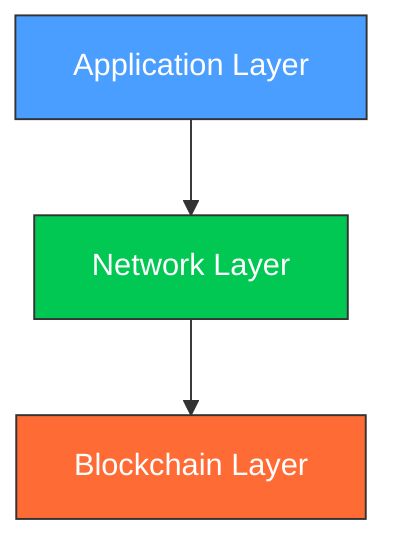

# What is Lethean?

Lethean is **confidential infrastructure for assured information exchange**. It combines a privacy-preserving blockchain with a distributed network layer to enable secure data logistics where you maintain complete sovereignty over your information.

## The Problem We Solve

Modern digital infrastructure forces a fundamental compromise: to participate in the digital economy, you must surrender control of your data to third parties. Cloud providers, payment processors, and network operators all become custodians of your sensitive information—and potential points of failure, surveillance, or exploitation.

Lethean eliminates this compromise by providing:

- **Data Sovereignty**: Your data remains under your control, cryptographically secured and never dependent on third-party trust
- **Confidential Transactions**: Exchange value and information with verifiable integrity, without exposing sensitive details
- **Resilient Infrastructure**: A globally distributed network with no central point of failure or control

## How It Works

Lethean operates across three integrated layers:

### Blockchain Layer
The foundation of trust. A privacy-preserving ledger built on [CryptoNote](https://cryptonote.org/) technology with [Zano](https://zano.org/) enhancements, providing:

- Confidential transactions with hidden amounts
- Hybrid PoW/PoS consensus for security and efficiency
- Native asset creation (Confidential Assets)
- Auditable wallets for compliance when needed

### Network Layer
Secure data transit infrastructure that routes information through a distributed network of nodes. Unlike traditional networks, Lethean's network layer enforces ethical constraints at the protocol level through the [Axioms of Life](../web3/labs/gateway.md) framework.

### Application Layer
User-facing tools including wallets, the desktop application, and developer SDKs that make the infrastructure accessible for both individuals and enterprises.

## What Makes Lethean Different

### Ethical by Design
Lethean embeds ethical principles directly into its protocol through the **Axioms of Life**—a framework that ensures the network cannot be weaponized against its users. This isn't policy that can be changed; it's cryptographically enforced architecture.

### Community Governed
Since 2020, Lethean has been entirely community-managed. No corporate ownership, no VC pressure, no hidden agendas. Development decisions are made transparently by those who build and use the network.

### Perpetual & Free
Lethean is licensed under [EUPL-1.2](https://joinup.ec.europa.eu/collection/eupl/eupl-text-eupl-12), ensuring it remains free and open source forever. There are no premium tiers, no artificial limitations, no planned obsolescence.

### Built for the Future
The architecture is designed to accommodate emerging regulatory requirements without compromising core principles. Auditable wallets, consent-based data sharing, and verifiable compliance are built in—not bolted on.

## Use Cases

**For Individuals**

- Secure personal communications and data storage
- Private financial transactions
- Digital identity that you control

**For Enterprises**

- Confidential B2B data exchange
- Supply chain integrity verification
- Regulatory-compliant audit trails without exposing business intelligence

**For Developers**

- Build applications on sovereign infrastructure
- Integrate privacy-preserving payments
- Access SDKs in [30+ languages](../getting-started/developer/sdks.md)

## Getting Started

Ready to explore? Choose your path:

-   :material-wallet: **Use Lethean**

    ---

    Set up a wallet and start transacting

    [:octicons-arrow-right-24: Wallet Guide](../getting-started/wallet.md)

-   :material-server: **Run a Node**

    ---

    Support the network by running blockchain infrastructure

    [:octicons-arrow-right-24: Node Setup](../getting-started/chain.md)

-   :material-code-braces: **Build on Lethean**

    ---

    Integrate Lethean into your applications

    [:octicons-arrow-right-24: Developer Docs](../getting-started/developer/index.md)

## Learn More

- [Tokenomics](../web3/tokenomics.md) - Understand the economic model
- [Gateway Architecture](../web3/labs/gateway.md) - Deep dive into the Axioms of Life
- [Project Updates](../updates/index.md) - Latest development news
