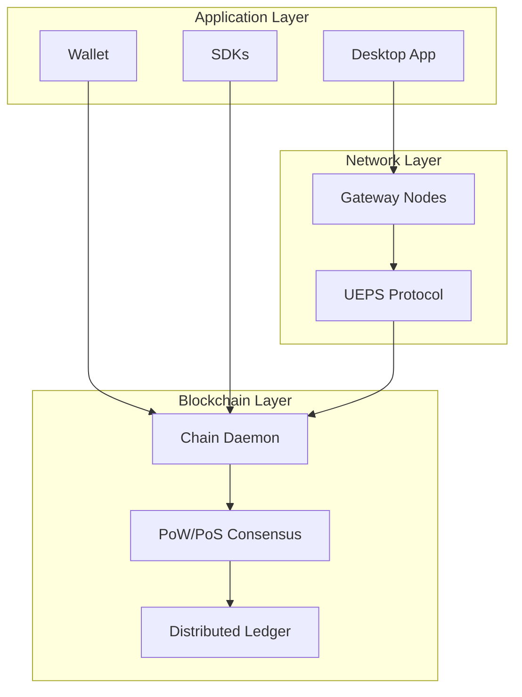
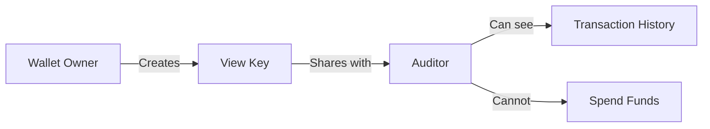
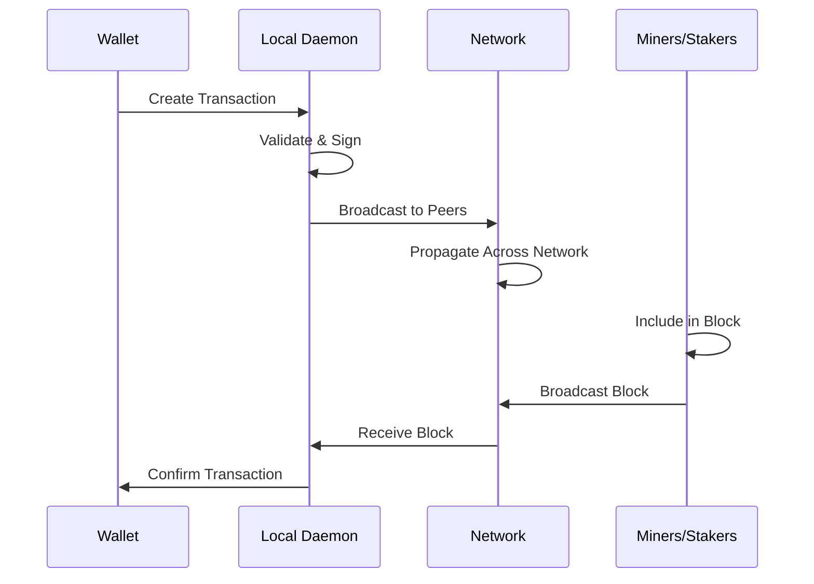

# Network Architecture

Lethean's network architecture is designed around three core principles: **confidentiality**, **sovereignty**, and **resilience**. This document provides a technical overview of how these principles are implemented.

## System Overview



## Blockchain Layer

The foundation of Lethean is a privacy-preserving blockchain built on [CryptoNote](https://cryptonote.org/) technology with [Zano](https://zano.org/) enhancements.

### Consensus Mechanism

Lethean uses a hybrid **Proof-of-Work (PoW)** and **Proof-of-Stake (PoS)** consensus:

| Mechanism | Purpose | Distribution |
|-----------|---------|--------------|
| PoW | Network security, fair distribution | 45% of emissions |
| PoS | Energy efficiency, holder incentives | 45% of emissions |
| Dev Fund | Development sustainability | 10% of emissions |

This hybrid approach provides:

- **Security**: PoW mining makes 51% attacks economically prohibitive
- **Efficiency**: PoS reduces energy consumption for block validation
- **Decentralization**: Multiple paths to participate in consensus

### Privacy Features

| Feature | Description |
|---------|-------------|
| **Ring Signatures** | Transaction inputs are mixed with decoys, hiding the true sender |
| **Stealth Addresses** | One-time addresses prevent linking transactions to recipients |
| **RingCT** | Transaction amounts are cryptographically hidden |
| **Confidential Assets** | Custom tokens inherit the same privacy guarantees as LTHN |

### Auditable Wallets

For compliance use cases, Lethean supports **auditable wallets** that allow designated parties to verify transactions without gaining spending control:



## Network Layer

The network layer handles secure data transit across the distributed infrastructure.

### Node Types

| Type | Role | Requirements |
|------|------|--------------|
| **Full Node** | Validates all transactions, maintains complete blockchain | 50GB+ storage, stable connection |
| **Light Client** | Connects to remote nodes, reduced resource usage | Minimal |
| **Gateway Node** | Routes network traffic, enforces protocol rules | Higher bandwidth, uptime requirements |

### Peer-to-Peer Protocol

Nodes communicate via an encrypted P2P protocol:

- **Discovery**: Nodes find peers through seed nodes and peer exchange
- **Sync**: New nodes download and verify the blockchain from peers
- **Propagation**: Transactions and blocks are broadcast across the network
- **Default Port**: 48772 (mainnet)

### UEPS Protocol

The **Unified Ethical Protocol Stack (UEPS)** is Lethean's application-layer protocol for the Gateway network. It enforces ethical constraints at the protocol level.

| Layer | Function |
|-------|----------|
| Physical | Transport-agnostic (IP, fiber, future media) |
| Link | Mutual authentication with identity records |
| Network | Axiom-weighted routing based on intent alignment |
| Transport | Consent-encapsulated streams with signed envelopes |
| Session | Rehabilitation negotiation for anomaly detection |
| Application | Prime-imperative guard filtering |

For deep technical details, see [Gateway (CM-OS)](../web3/labs/gateway.md).

## Data Flow

### Transaction Lifecycle



### Block Production

1. **PoW Path**: Miners solve cryptographic puzzles to produce blocks
2. **PoS Path**: Stakers are selected based on stake weight to validate blocks
3. **Validation**: All nodes verify blocks against consensus rules
4. **Finality**: After sufficient confirmations, transactions are considered final

## Network Parameters

| Parameter | Value |
|-----------|-------|
| Block Time | ~120 seconds |
| Max Block Size | Dynamic (based on median) |
| Default P2P Port | 48772 |
| Default RPC Port | 48782 |
| Address Prefix | `iz` (standard), `aiz` (auditable) |

## Security Model

### Attack Resistance

| Attack Vector | Mitigation |
|---------------|------------|
| 51% Attack | Hybrid PoW/PoS increases cost |
| Sybil Attack | Proof-of-work for node reputation |
| Eclipse Attack | Multiple seed nodes, peer diversity |
| Transaction Analysis | Ring signatures, stealth addresses |

### Network Health

The network maintains health through:

- **Difficulty Adjustment**: Adapts to hashrate changes
- **Peer Scoring**: Nodes track peer reliability
- **Ban Lists**: Misbehaving peers are temporarily banned

## Integration Points

### RPC API

The daemon exposes a REST API for programmatic access:

```
GET  /info           # Network status
GET  /block/height   # Current height
GET  /block/{id}     # Block details
POST /block/template # Mining template
POST /block/submit   # Submit mined block
```

See [SDK Documentation](../getting-started/developer/sdks.md) for client libraries.

### Wallet RPC

Wallet functionality is exposed via a separate RPC interface for transaction management, address generation, and balance queries.

## Further Reading

- [Tokenomics](../web3/tokenomics.md) - Economic model details
- [Gateway (CM-OS)](../web3/labs/gateway.md) - UEPS protocol deep-dive
- [Node Setup](../getting-started/chain.md) - Run your own node
- [Build Guide](../getting-started/developer/build.md) - Compile from source
