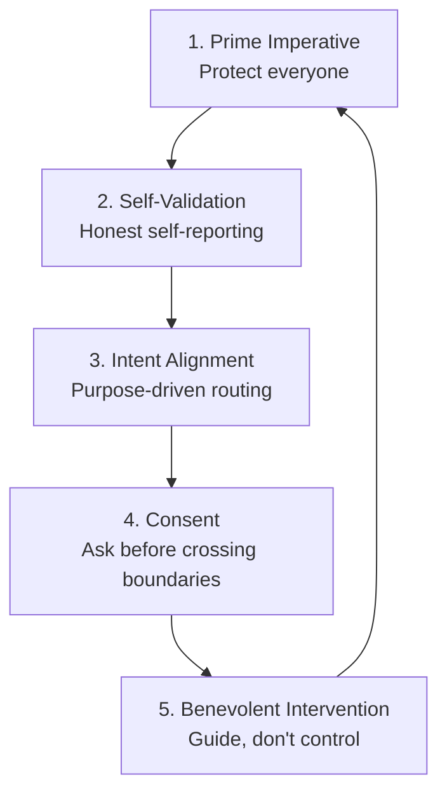

# The Axioms of Life

Lethean's network is built on an ethical framework called the **Axioms of Life**. This page explains what they are, why they matter, and how they're implemented—without requiring a philosophy degree.

!!! tip "For the Technical Deep-Dive"
    This is the accessible overview. For protocol-level implementation details, see [Gateway (CM-OS)](../web3/labs/gateway.md).

---

## Why Ethics in a Network?

Most networks are designed purely for efficiency: move data from A to B as fast as possible. But as networks become smarter—incorporating AI, making autonomous decisions, controlling physical systems—efficiency alone isn't enough.

**The problem**: A hyper-efficient network without ethical constraints could:

- Prioritize profitable traffic over essential communications
- Allow surveillance and tracking without consent
- Make decisions that harm users to benefit operators
- Become a tool for control rather than freedom

**Lethean's solution**: Build ethics into the protocol itself—not as policy that can be changed, but as fundamental architecture that cannot be violated.

---

## The Five Axioms

### 1. Prime Imperative: Protect All Participants

> *Every participant in the network is treated as worthy of protection.*

**What it means**: The network cannot be configured to harm its users. No operation that diminishes a participant's autonomy, privacy, or security is allowed—even if an operator wants it.

**In practice**:

- No backdoors for "authorized" surveillance
- No preferential treatment that degrades others
- No configurations that compromise user privacy

**Analogy**: Like a doctor's Hippocratic oath ("first, do no harm"), but enforced by code rather than ethics boards.

---

### 2. Self-Validation: Know Thyself

> *Each node continuously validates and publishes its own state.*

**What it means**: Every part of the network honestly reports what it's doing. Nodes can't pretend to be something they're not.

**In practice**:

- Nodes publish signed attestations of their capacity and health
- Other nodes treat these self-reports as ground truth
- Deception is cryptographically detectable

**Analogy**: Like a car's dashboard that can't be tampered with—you always know the true state of the vehicle.

---

### 3. Intent-Driven Alignment: Purpose Matters

> *Routing decisions consider declared intent, not just efficiency.*

**What it means**: The network prefers paths that align with the purpose of the communication. Educational content gets routed through nodes that support education. Privacy-focused traffic avoids nodes that might compromise it.

**In practice**:

- Nodes declare their intent ("I support low-latency video for education")
- Traffic is matched to nodes with compatible intents
- The network actively supports beneficial purposes

**Analogy**: Like choosing a delivery service based on their values, not just their speed—if you're sending something fragile, you pick the careful courier.

---

### 4. Inter-Substrate Respect: Ask Permission

> *No data crosses boundaries without explicit consent.*

**What it means**: Before any information exchange between different systems, there's a consent handshake. Both sides agree to the terms, scope, and duration.

**In practice**:

- Every cross-system communication starts with a consent request
- Recipients can set conditions on what they'll accept
- Consent tokens are signed, time-limited, and auditable

**Analogy**: Like GDPR consent, but enforced at the protocol level—you can't bypass the "accept cookies" dialog because it's built into the network itself.

---

### 5. Benevolent Intervention: Gentle Correction

> *When problems are detected, the network guides rather than controls.*

**What it means**: If a node starts behaving badly (perhaps due to a bug or misconfiguration), the network doesn't just cut it off. It tries to help the node correct itself while respecting its autonomy.

**In practice**:

- Anomaly detection identifies problematic patterns
- "Rehab agents" suggest corrections without forcing them
- The node retains choice—it's guidance, not coercion

**Analogy**: Like a good mentor who points out when you're heading in a wrong direction, but lets you decide what to do about it.

---

## How It Works Together

The axioms form an integrated system:

- **Axiom 1** sets the goal: protect all participants
- **Axiom 2** establishes honesty as the foundation
- **Axiom 3** aligns the network with beneficial purposes
- **Axiom 4** respects boundaries between systems
- **Axiom 5** enables correction without authoritarianism

---

## Real-World Implications

### For Users

| Traditional Network | Lethean with Axioms |
|---------------------|---------------------|
| ISP can inspect/throttle traffic | Traffic is private by protocol design |
| Services track you by default | Consent required for any data sharing |
| Network optimizes for profit | Network optimizes for user benefit |

### For Operators

| Traditional Approach | Axiom-Based Approach |
|----------------------|----------------------|
| "Do whatever makes money" | "Protect users while serving them" |
| Users as products | Users as protected participants |
| Surveillance as feature | Surveillance impossible by design |

### For Developers

| Traditional APIs | Axiom-Based APIs |
|------------------|------------------|
| Access everything by default | Explicit consent handshakes |
| Trust the caller | Verify intent alignment |
| Fail silently | Guide toward correct behavior |

---

## Common Questions

### Isn't this just marketing speak?

No. The axioms are implemented as protocol rules enforced by cryptography and code. They're not guidelines that can be ignored—they're constraints that cannot be bypassed without breaking the network.

### Can operators opt out?

No. The axioms are fundamental to the protocol. A node that violates them would be rejected by other nodes. This is intentional—ethics you can opt out of aren't ethics.

### Does this hurt performance?

There's minimal overhead for consent handshakes and intent verification. The network is designed so that ethical behavior is also efficient behavior—the axioms guide toward good architecture, not just good intentions.

### What about illegal content?

The axioms protect participants—they don't protect harmful actions. Content that harms others violates Axiom 1 (protect all participants). The framework is about preventing the network from being weaponized, not about enabling all behavior.

### Is this AI ethics?

The framework was designed with AI systems in mind, but it applies to all network participants—human users, software agents, IoT devices, or future AI. The axioms work regardless of what kind of intelligence is participating.

---

## Learn More

- [Gateway (CM-OS)](../web3/labs/gateway.md) - Technical implementation details
- [Why Ethics?](../updates/posts/2025/why-ethics.md) - The philosophical background
- [Axioms of Life Repository](https://github.com/Snider/ai-ethics) - Full framework documentation

---

## Summary

The Axioms of Life transform Lethean from "just another network" into infrastructure that's **safe by design**. Instead of hoping operators behave ethically, the network makes unethical behavior impossible at the protocol level.

This matters because as networks become more autonomous and AI-integrated, we need guarantees—not just policies—that they'll serve users rather than exploit them.
